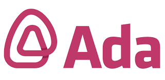

<p align="center">
  
</p>

<h2 align="center">📚 PROYECTO INTEGRADOR</h2>

---

Este proyecto fue realizado para finalizar el primer módulo de **Introducción a JavaScript** en **ADA**.

📎 Este repositorio pertenece a **Silvana Andrea Condori Aguirre** 👩🏽‍🦰

---

## 🔍 Descripción

Este Proyecto fue creado como práctica final del módulo, donde se pone en funcionamiento un conjunto de herramientas y conceptos fundamentales de programación con JavaScript. Simula una biblioteca digital con operaciones básicas.

---

## 🚀 Funcionalidades

- 📚 Registrar libros nuevos
- 🗑️ Eliminar libros existentes
- 👤 Registrar usuarios
- 🔄 Prestar y devolver libros
- 🔎 Buscar libros por nombre o ID
- 🔃 Ordenar libros (Bubble Sort)

---

## ⚙️ Tecnologías Usadas

- JavaScript (ES6+)
- Node.js (si se usa en consola)
- Visual Studio Code & GitHub

---

## 🧪 Cómo Usarlo

1. Cloná este repositorio:
   ```bash
   git clone https://github.com/Sil0105/SilvanaCondori.js.git
   ```

2. Entrá a la carpeta del proyecto:
   ```bash
   cd SilvanaCondori.js.git
   ```

3. Ejecutá el archivo principal:
   ```bash
   node app.js
   ```

📌 Asegurate de tener Node.js instalado para correr el proyecto.

---

## 📁 Estructura del Proyecto

```
📦 tu-repo
├── 📁 assets
│   └── logo.png
├── 📄 README.md
├── 📄 app.js
├── 📁 data
│   └── libros.json
├── 📁 utils
│   └── funciones.js
```

---

## 📝 Créditos

Desarrollado con 💙 por **Silvana Andrea Condori Aguirre** como parte del programa de formación en **ADA ITW**.

---
